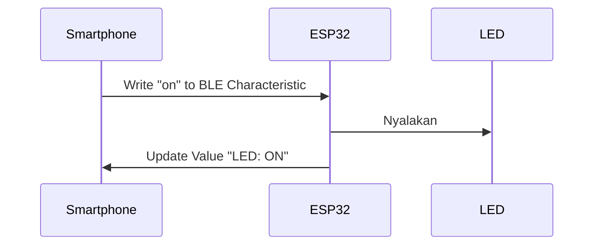

### **Pertemuan 10: Bluetooth Classic dan BLE (ESP32)**
#### **1. Perbedaan Bluetooth Classic vs BLE**
| Fitur               | Bluetooth Classic       | BLE (Bluetooth Low Energy) |
|---------------------|------------------------|---------------------------|
| Konsumsi Daya       | Tinggi                 | Sangat Rendah             |
| Kecepatan Transfer  | Cepat (2-3 Mbps)       | Lambat (1 Mbps)           |
| Use Case           | Audio, file transfer   | Sensor, IoT devices       |
| Komunikasi         | Serial (SPP)           | GATT (Services & Characteristics) |

---

### **2. Bluetooth Classic (Serial Mode)**
#### **Komponen yang Dibutuhkan**:
- ESP32
- Smartphone dengan aplikasi **Serial Bluetooth Terminal** (Android)
- LED + resistor 220Ω

#### **Rangkaian**:
```
ESP32:
- GPIO2 -> LED (+) -> Resistor 220Ω -> GND
```

#### **Kode Program**:
```cpp
#include "BluetoothSerial.h"

BluetoothSerial SerialBT;
#define LED_PIN 2

void setup() {
  Serial.begin(115200);
  SerialBT.begin("ESP32-BT-Classic"); // Nama device Bluetooth
  pinMode(LED_PIN, OUTPUT);
  Serial.println("Bluetooth Classic siap!");
}

void loop() {
  if (SerialBT.available()) {
    char command = SerialBT.read();
    Serial.write(command);

    if (command == '1') {
      digitalWrite(LED_PIN, HIGH);
      SerialBT.println("LED ON");
    } else if (command == '0') {
      digitalWrite(LED_PIN, LOW);
      SerialBT.println("LED OFF");
    }
  }
  delay(20);
}
```

#### **Cara Pengujian**:
1. Upload kode ke ESP32.
2. Pairing ESP32 dengan smartphone via Bluetooth (nama: `ESP32-BT-Classic`).
3. Buka aplikasi **Serial Bluetooth Terminal**, kirim:
   - `1` untuk nyalakan LED
   - `0` untuk matikan LED

---

### **3. BLE (Bluetooth Low Energy)**
#### **Komponen yang Dibutuhkan**:
- ESP32
- Smartphone dengan aplikasi **nRF Connect** (Android/iOS)
- LED + resistor 220Ω

#### **Rangkaian** (sama seperti Bluetooth Classic)

#### **Kode Program**:
```cpp
#include <BLEDevice.h>
#include <BLEServer.h>
#include <BLEUtils.h>

#define LED_PIN 2
#define SERVICE_UUID        "4fafc201-1fb5-459e-8fcc-c5c9c331914b"
#define CHARACTERISTIC_UUID "beb5483e-36e1-4688-b7f5-ea07361b26a8"

bool ledState = false;
BLECharacteristic *pCharacteristic;

class MyCallbacks: public BLECharacteristicCallbacks {
  void onWrite(BLECharacteristic *pCharacteristic) {
    std::string value = pCharacteristic->getValue();
    if (value == "on") {
      digitalWrite(LED_PIN, HIGH);
      ledState = true;
    } else if (value == "off") {
      digitalWrite(LED_PIN, LOW);
      ledState = false;
    }
  }
};

void setup() {
  Serial.begin(115200);
  pinMode(LED_PIN, OUTPUT);

  BLEDevice::init("ESP32-BLE");
  BLEServer *pServer = BLEDevice::createServer();
  BLEService *pService = pServer->createService(SERVICE_UUID);
  
  pCharacteristic = pService->createCharacteristic(
    CHARACTERISTIC_UUID,
    BLECharacteristic::PROPERTY_READ |
    BLECharacteristic::PROPERTY_WRITE
  );

  pCharacteristic->setCallbacks(new MyCallbacks());
  pCharacteristic->setValue("Status: Ready");
  pService->start();

  BLEAdvertising *pAdvertising = pServer->getAdvertising();
  pAdvertising->start();
  Serial.println("BLE siap! Gunakan nRF Connect untuk terkoneksi");
}

void loop() {
  delay(1000);
  // Update karakteristik dengan status LED
  if (ledState) {
    pCharacteristic->setValue("LED: ON");
  } else {
    pCharacteristic->setValue("LED: OFF");
  }
}
```

#### **Cara Pengujian**:
1. Upload kode ke ESP32.
2. Buka **nRF Connect**, scan device `ESP32-BLE`.
3. Connect ke device, cari service UUID `4fafc201...`.
4. Tulis `on` atau `off` pada characteristic UUID `beb5483e...`.

---

### **4. Perbandingan Implementasi**
| Fitur               | Bluetooth Classic       | BLE                     |
|---------------------|------------------------|-------------------------|
| Library            | `BluetoothSerial.h`    | `BLEDevice.h`           |
| Komunikasi         | Serial (SPP)           | GATT Service            |
| Aplikasi Smartphone | Serial Terminal        | nRF Connect             |
| Contoh Perintah    | `1`/`0` (ASCII)        | `"on"`/`"off"` (String) |

---

### **5. Proyek: Kontrol LED via Smartphone**
#### **Langkah-langkah**:
1. **Bluetooth Classic**:
   - Gunakan aplikasi **Serial Bluetooth Terminal**.
   - Kirim perintah ASCII sederhana.

2. **BLE**:
   - Gunakan **nRF Connect** untuk menulis nilai string.
   - BLE lebih cocok untuk aplikasi IoT dengan konsumsi daya rendah.

---

### **6. Troubleshooting**
| Masalah | Solusi |
|---------|--------|
| Bluetooth tidak terdeteksi | Pastikan ESP32 sudah dipairing |
| Perintah tidak bekerja | Cek koneksi pin LED dan kode karakter (`'1'` vs `"on"`) |
| BLE tidak muncul di scan | Restart ESP32 dan aplikasi nRF Connect |

---

### **Diagram Komunikasi BLE**


---

### **Referensi**
- [ESP32 Bluetooth Classic Docs](https://docs.espressif.com/projects/esp-idf/en/latest/esp32/api-reference/bluetooth/classic_bt.html)
- [ESP32 BLE Guide](https://randomnerdtutorials.com/esp32-bluetooth-low-energy-ble-arduino-ide/)
