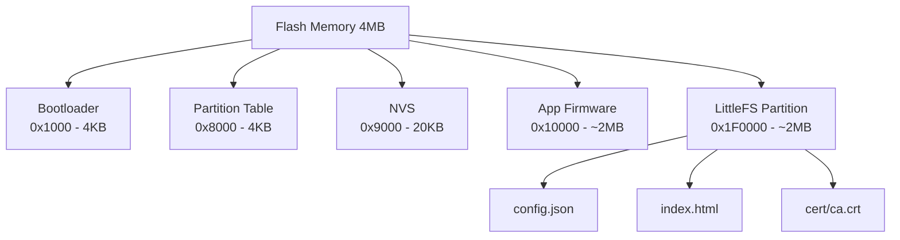

### **Pertemuan 13: Partisi Memory dan LittleFS pada ESP32**

#### **Tujuan Pembelajaran**
- Memahami struktur partisi memory pada ESP32.
- Mengenal LittleFS sebagai filesystem untuk penyimpanan file di flash memory.
- Mampu mengkonfigurasi custom partition table di PlatformIO.
- Mampu melakukan operasi baca/tulis file menggunakan LittleFS.
- Menerapkan LittleFS untuk menyimpan konfigurasi IoT secara persisten.

---

#### **1. Arsitektur Memory ESP32**

**Jenis Memory pada ESP32**:
| Jenis Memory | Kapasitas | Keterangan |
|---|---|---|
| SRAM (Internal RAM) | 520 KB | Untuk variabel dan stack program |
| Flash (SPI Flash) | 4 MB – 16 MB | Untuk firmware, filesystem, NVS |
| RTC RAM | 16 KB | Bertahan saat deep sleep |
| ROM | 448 KB | Bootloader dan library bawaan |

**Pembagian Flash Memory**:
- Flash eksternal terhubung via SPI dan dibagi menjadi beberapa partisi.
- Partisi diatur dalam sebuah **partition table** yang disimpan di awal flash.
- Setiap partisi memiliki tipe, subtype, offset, dan ukuran.

---

#### **2. Partition Table ESP32**

**Konsep Partition Table**:
- Partition table adalah daftar terstruktur yang mendefinisikan layout flash memory.
- Disimpan di offset `0x8000` pada flash.
- Format default: file CSV (`partitions.csv`).

**Tipe Partisi**:
| Tipe | Subtype | Fungsi |
|---|---|---|
| `app` | `factory`, `ota_0`, `ota_1` | Penyimpanan firmware aplikasi |
| `data` | `nvs` | Non-Volatile Storage (konfigurasi kecil) |
| `data` | `otadata` | Metadata OTA update |
| `data` | `spiffs` | SPIFFS / LittleFS filesystem |
| `data` | `fat` | FAT filesystem |
| `data` | `eeprom` | Emulasi EEPROM |
| `data` | `coredump` | Menyimpan core dump saat crash |

**Contoh Default Partition Table**:
```
# Name,   Type, SubType, Offset,  Size, Flags
nvs,      data, nvs,     0x9000,  0x5000,
otadata,  data, ota,     0xe000,  0x2000,
app0,     app,  ota_0,   0x10000, 0x140000,
app1,     app,  ota_1,   0x150000,0x140000,
spiffs,   data, spiffs,  0x290000,0x170000,
```

**Custom Partition Table untuk LittleFS**:
```
# Name,   Type, SubType, Offset,  Size, Flags
nvs,      data, nvs,     0x9000,  0x5000,
app0,     app,  factory, 0x10000, 0x1E0000,
spiffs,   data, spiffs,  0x1F0000,0x210000,
```

> **Penting**: Nama partisi harus `spiffs` (bukan `littlefs`). ESP32 Arduino LittleFS library mencari partisi bernama `spiffs` secara default. Nama `spiffs` di sini hanyalah label — filesystem yang digunakan tetap LittleFS, ditentukan oleh `board_build.filesystem = littlefs` di `platformio.ini`.

---

#### **3. Pengenalan LittleFS**

**Apa itu LittleFS?**
- Filesystem ringan (*lightweight*) yang dirancang untuk perangkat dengan resource terbatas (microcontroller, flash NAND/NOR).
- Dikembangkan oleh ARM Mbed sebagai pengganti SPIFFS.
- Mendukung operasi file standar: baca, tulis, hapus, direktori.

**Perbandingan LittleFS vs SPIFFS**:
| Fitur | SPIFFS | LittleFS |
|---|---|---|
| Direktori | Tidak didukung (flat) | Didukung (hierarki folder) |
| Power-loss safety | Terbatas | Lebih baik (atomic operations) |
| Kecepatan tulis | Lambat (wear leveling manual) | Lebih cepat |
| Fragmentasi | Rentan | Minimal |
| Metadata file | Terbatas | Lengkap (ukuran, timestamp) |
| Maksimum file | 32 file | Tidak terbatas |
| Status | Deprecated (Arduino ESP32 ≥ v2) | Rekomendasi aktif |

**Keunggulan LittleFS untuk IoT**:
- **Power-loss resilient**: Tidak korup saat daya terputus tiba-tiba.
- **Wear leveling**: Distribusi penulisan merata ke seluruh blok flash.
- **Hierarki direktori**: Memungkinkan organisasi file lebih rapi.
- **Cocok untuk konfigurasi**: Menyimpan `config.json`, sertifikat TLS, halaman web.

---

#### **4. Konfigurasi LittleFS di PlatformIO**

**Konfigurasi `platformio.ini`**:
```ini
[env:esp32dev]
platform = espressif32
board = esp32dev
framework = arduino
board_build.filesystem = littlefs
board_build.partitions = partitions.csv
monitor_speed = 115200
lib_deps =
  bblanchon/ArduinoJson@^7.0.0
  knolleary/PubSubClient@^2.8
```

**Custom `partitions.csv`**:
```csv
# Name,   Type, SubType,  Offset,   Size,     Flags
nvs,      data, nvs,      0x9000,   0x5000,
app0,     app,  factory,  0x10000,  0x1E0000,
spiffs,   data, spiffs,   0x1F0000, 0x210000,
```

> **Penting**: Nama partisi harus `spiffs`. ESP32 Arduino LittleFS library mencari partisi berlabel `spiffs` secara default. Filesystem yang aktif tetap LittleFS — ditentukan oleh `board_build.filesystem = littlefs` di `platformio.ini`.

**Folder `data/` untuk Upload File**:
- PlatformIO menyediakan fitur **LittleFS Upload Tool**.
- Semua file di folder `data/` akan di-upload ke partisi LittleFS.
- Upload dilakukan dengan perintah: `Upload Filesystem Image`.

**Struktur Project**:
```
project/
├── src/
│   └── main.cpp          ← Kode program utama
├── data/                 ← File yang akan diupload ke LittleFS
│   ├── config.json       ← Konfigurasi WiFi/MQTT
│   ├── index.html        ← Halaman web (opsional)
│   └── cert/
│       └── ca.crt        ← Sertifikat TLS (opsional)
├── partitions.csv        ← Custom partition table
└── platformio.ini        ← Konfigurasi PlatformIO
```

---

#### **5. Operasi File dengan LittleFS**

**Daftar Operasi yang Akan Dipelajari**:

| Operasi | Fungsi | Keterangan |
|---|---|---|
| Mount | `LittleFS.begin()` | Inisialisasi filesystem |
| Format | `LittleFS.format()` | Format ulang partisi |
| Cek Info | `LittleFS.totalBytes()` | Kapasitas total |
| Buka File | `LittleFS.open(path, mode)` | Mode: `"r"`, `"w"`, `"a"` |
| Tulis File | `file.print()` / `file.write()` | Menulis data ke file |
| Baca File | `file.readString()` | Membaca isi file |
| Tutup File | `file.close()` | Menutup file handle |
| Hapus File | `LittleFS.remove(path)` | Menghapus file |
| List Dir | `LittleFS.openDir(path)` | Iterasi isi direktori |
| Buat Dir | `LittleFS.mkdir(path)` | Membuat folder |
| Hapus Dir | `LittleFS.rmdir(path)` | Menghapus folder kosong |

**Mode Buka File**:
- `"r"` — Read only (file harus ada)
- `"w"` — Write (buat baru / timpa)
- `"a"` — Append (tambah di akhir)
- `"r+"` — Read dan Write
- `FILE_READ`, `FILE_WRITE` — Konstanta alternatif

**Kode Program: Operasi Dasar LittleFS**

File: `src/main.cpp`
```cpp
#include <Arduino.h>
#include <LittleFS.h>

void listDir(const char* path) {
  Serial.printf("\n=== Isi direktori: %s ===\n", path);
  File root = LittleFS.open(path);
  if (!root || !root.isDirectory()) {
    Serial.println("Gagal membuka direktori.");
    return;
  }
  File entry = root.openNextFile();
  while (entry) {
    Serial.printf("  [%s] %s  (%d bytes)\n",
      entry.isDirectory() ? "DIR " : "FILE",
      entry.name(),
      entry.size());
    entry = root.openNextFile();
  }
}

void setup() {
  Serial.begin(115200);
  delay(1000);

  // Mount LittleFS; parameter true = auto-format jika belum terformat
  if (!LittleFS.begin(true)) {
    Serial.println("FATAL: Gagal mount LittleFS!");
    return;
  }
  Serial.println("LittleFS berhasil di-mount.");

  // Info kapasitas
  Serial.printf("Total  : %u bytes\n", LittleFS.totalBytes());
  Serial.printf("Dipakai: %u bytes\n", LittleFS.usedBytes());

  // --- TULIS FILE ---
  File f = LittleFS.open("/catatan.txt", "w");
  if (f) {
    f.println("Halo dari ESP32!");
    f.println("LittleFS berjalan dengan baik.");
    f.close();
    Serial.println("\nFile /catatan.txt berhasil ditulis.");
  }

  // --- BACA FILE ---
  f = LittleFS.open("/catatan.txt", "r");
  if (f) {
    Serial.println("\n=== Isi /catatan.txt ===");
    while (f.available()) {
      Serial.write(f.read());
    }
    f.close();
  }

  // --- APPEND FILE ---
  f = LittleFS.open("/catatan.txt", "a");
  if (f) {
    f.println("Baris tambahan via append.");
    f.close();
    Serial.println("Append ke /catatan.txt berhasil.");
  }

  // --- BUAT DIREKTORI ---
  LittleFS.mkdir("/logs");
  Serial.println("Direktori /logs dibuat.");

  // --- TULIS FILE DI SUBDIREKTORI ---
  f = LittleFS.open("/logs/boot.log", "w");
  if (f) {
    f.println("Boot #1 - OK");
    f.close();
  }

  // --- LIST DIREKTORI ---
  listDir("/");
  listDir("/logs");

  // --- CEK KEBERADAAN FILE ---
  if (LittleFS.exists("/catatan.txt")) {
    Serial.println("\nFile /catatan.txt ada.");
  }

  // --- HAPUS FILE ---
  LittleFS.remove("/catatan.txt");
  Serial.println("File /catatan.txt dihapus.");

  listDir("/");
}

void loop() {}
```

**Output yang Diharapkan di Serial Monitor**:
```
LittleFS berhasil di-mount.
Total  : 2166784 bytes
Dipakai: 0 bytes

File /catatan.txt berhasil ditulis.

=== Isi /catatan.txt ===
Halo dari ESP32!
LittleFS berjalan dengan baik.

Append ke /catatan.txt berhasil.
Direktori /logs dibuat.

=== Isi direktori: / ===
  [FILE] catatan.txt  (67 bytes)
  [DIR ] logs  (0 bytes)

=== Isi direktori: /logs ===
  [FILE] boot.log  (11 bytes)

File /catatan.txt ada.
File /catatan.txt dihapus.

=== Isi direktori: / ===
  [DIR ] logs  (0 bytes)
```

---

#### **6. Contoh Penggunaan: Konfigurasi IoT Persisten**

**Skenario**:
- Menyimpan konfigurasi WiFi dan MQTT ke file `config.json` di LittleFS.
- ESP32 membaca konfigurasi dari file saat boot, bukan dari hardcode.
- Jika file tidak ada, gunakan nilai default dan simpan ke LittleFS.

**Alur Program**:
```
Boot ESP32
    ↓
Mount LittleFS
    ↓
Cek apakah config.json ada?
    ├── Ada → Baca dan parse JSON
    └── Tidak ada → Gunakan default, simpan config.json baru
    ↓
Koneksi WiFi menggunakan konfigurasi
    ↓
Koneksi MQTT menggunakan konfigurasi
    ↓
Loop: Publish sensor data
```

**Format `config.json`** (disimpan di folder `data/`):
```json
{
  "wifi_ssid": "NAMA_WIFI",
  "wifi_pass": "PASSWORD_WIFI",
  "mqtt_server": "broker.emqx.io",
  "mqtt_port": 1883,
  "mqtt_topic": "iot/kelas/sensor",
  "device_id": "ESP32-001"
}
```

**Library Pendukung**:
- `LittleFS.h` — Filesystem (bawaan ESP32 Arduino core)
- `ArduinoJson.h` — Parsing dan serialisasi JSON
- `PubSubClient.h` — Koneksi MQTT

**Kode Program Lengkap: Konfigurasi IoT Persisten dengan LittleFS**

**Langkah 1** — Buat file `data/config.json` (akan di-upload ke LittleFS):
```json
{
  "wifi_ssid": "NAMA_WIFI",
  "wifi_pass": "PASSWORD_WIFI",
  "mqtt_server": "broker.emqx.io",
  "mqtt_port": 1883,
  "mqtt_topic": "iot/kelas/sensor",
  "device_id": "ESP32-001"
}
```

**Langkah 2** — Upload filesystem: di PlatformIO, klik **"Upload Filesystem Image"** (bukan "Upload").

**Langkah 3** — Tulis `src/main.cpp`:
```cpp
#include <Arduino.h>
#include <WiFi.h>
#include <PubSubClient.h>
#include <LittleFS.h>
#include <ArduinoJson.h>

// Nilai default jika config.json tidak ditemukan
#define DEFAULT_SSID        "NAMA_WIFI"
#define DEFAULT_PASS        "PASSWORD_WIFI"
#define DEFAULT_MQTT_HOST   "broker.emqx.io"
#define DEFAULT_MQTT_PORT   1883
#define DEFAULT_MQTT_TOPIC  "iot/kelas/sensor"
#define DEFAULT_DEVICE_ID   "ESP32-001"

String cfg_ssid, cfg_pass, cfg_mqtt_host, cfg_mqtt_topic, cfg_device_id;
int    cfg_mqtt_port;
bool   fsReady = false;  // guard: cegah loop() jalan jika LittleFS gagal

WiFiClient   espClient;
PubSubClient mqtt(espClient);

// Baca dan parse config.json dari LittleFS
bool loadConfig() {
  if (!LittleFS.exists("/config.json")) return false;

  File f = LittleFS.open("/config.json", "r");
  if (!f) return false;

  JsonDocument doc;
  DeserializationError err = deserializeJson(doc, f);
  f.close();
  if (err) {
    Serial.printf("JSON error: %s\n", err.c_str());
    return false;
  }

  cfg_ssid       = doc["wifi_ssid"]   | DEFAULT_SSID;
  cfg_pass       = doc["wifi_pass"]   | DEFAULT_PASS;
  cfg_mqtt_host  = doc["mqtt_server"] | DEFAULT_MQTT_HOST;
  cfg_mqtt_port  = doc["mqtt_port"]   | DEFAULT_MQTT_PORT;
  cfg_mqtt_topic = doc["mqtt_topic"]  | DEFAULT_MQTT_TOPIC;
  cfg_device_id  = doc["device_id"]   | DEFAULT_DEVICE_ID;
  return true;
}

// Simpan konfigurasi ke config.json (untuk update runtime)
void saveConfig() {
  JsonDocument doc;
  doc["wifi_ssid"]   = cfg_ssid;
  doc["wifi_pass"]   = cfg_pass;
  doc["mqtt_server"] = cfg_mqtt_host;
  doc["mqtt_port"]   = cfg_mqtt_port;
  doc["mqtt_topic"]  = cfg_mqtt_topic;
  doc["device_id"]   = cfg_device_id;

  File f = LittleFS.open("/config.json", "w");
  if (!f) {
    Serial.println("Gagal menyimpan config.json!");
    return;
  }
  serializeJsonPretty(doc, f);
  f.close();
  Serial.println("Konfigurasi disimpan ke LittleFS.");
}

void connectWiFi() {
  WiFi.begin(cfg_ssid.c_str(), cfg_pass.c_str());
  Serial.printf("Menghubungkan ke WiFi '%s'", cfg_ssid.c_str());
  unsigned long start = millis();
  while (WiFi.status() != WL_CONNECTED && millis() - start < 15000) {
    delay(500);
    Serial.print(".");
  }
  if (WiFi.status() == WL_CONNECTED) {
    Serial.printf("\nIP: %s\n", WiFi.localIP().toString().c_str());
  } else {
    Serial.println("\nGagal terhubung ke WiFi!");
  }
}

void reconnectMQTT() {
  while (!mqtt.connected()) {
    String clientId = cfg_device_id + "-" + String(random(0xffff), HEX);
    Serial.printf("Menghubungkan ke MQTT %s:%d ...", cfg_mqtt_host.c_str(), cfg_mqtt_port);
    if (mqtt.connect(clientId.c_str())) {
      Serial.println(" OK");
    } else {
      Serial.printf(" Gagal (rc=%d), coba lagi 5 detik\n", mqtt.state());
      delay(5000);
    }
  }
}

void setup() {
  Serial.begin(115200);
  delay(1000);

  // Mount LittleFS
  if (!LittleFS.begin(true)) {
    Serial.println("FATAL: Gagal mount LittleFS! Upload filesystem image terlebih dahulu.");
    return;  // fsReady tetap false, loop() akan berhenti
  }
  fsReady = true;
  Serial.printf("LittleFS OK — total: %u bytes, dipakai: %u bytes\n",
    LittleFS.totalBytes(), LittleFS.usedBytes());

  // Muat konfigurasi; jika tidak ada, pakai default dan simpan
  if (loadConfig()) {
    Serial.println("Konfigurasi dimuat dari LittleFS.");
  } else {
    Serial.println("config.json tidak ada, menggunakan nilai default.");
    cfg_ssid       = DEFAULT_SSID;
    cfg_pass       = DEFAULT_PASS;
    cfg_mqtt_host  = DEFAULT_MQTT_HOST;
    cfg_mqtt_port  = DEFAULT_MQTT_PORT;
    cfg_mqtt_topic = DEFAULT_MQTT_TOPIC;
    cfg_device_id  = DEFAULT_DEVICE_ID;
    saveConfig();
  }

  Serial.printf("SSID       : %s\n", cfg_ssid.c_str());
  Serial.printf("MQTT Host  : %s:%d\n", cfg_mqtt_host.c_str(), cfg_mqtt_port);
  Serial.printf("MQTT Topic : %s\n", cfg_mqtt_topic.c_str());
  Serial.printf("Device ID  : %s\n", cfg_device_id.c_str());

  connectWiFi();
  mqtt.setServer(cfg_mqtt_host.c_str(), cfg_mqtt_port);
}

void loop() {
  if (!fsReady) return;  // halt jika LittleFS gagal mount

  if (!mqtt.connected()) reconnectMQTT();
  mqtt.loop();

  // Simulasi data sensor suhu (ganti dengan pembacaan sensor nyata)
  float temp = 24.0 + random(-10, 50) / 10.0;
  char payload[128];
  snprintf(payload, sizeof(payload),
    "{\"device\":\"%s\",\"temp\":%.1f}",
    cfg_device_id.c_str(), temp);

  if (mqtt.publish(cfg_mqtt_topic.c_str(), payload)) {
    Serial.printf("Publish OK: %s\n", payload);
  } else {
    Serial.println("Publish gagal!");
  }

  delay(5000);
}
```

**Penjelasan Kode**:

1. **`loadConfig()`**:
   - Cek keberadaan `/config.json` dengan `LittleFS.exists()`.
   - Baca file dan parse JSON menggunakan `ArduinoJson`.
   - Operator `|` sebagai fallback nilai default jika key tidak ditemukan.

2. **`saveConfig()`**:
   - Serialisasi struct konfigurasi ke JSON dan tulis ke file.
   - Digunakan saat file belum ada atau konfigurasi diperbarui.

3. **`connectWiFi()`**:
   - Timeout 15 detik agar program tidak hang selamanya jika WiFi tidak tersedia.

4. **`reconnectMQTT()`**:
   - Client ID acak mencegah konflik jika ada banyak device yang terhubung.

5. **`loop()`**:
   - Publish payload JSON setiap 5 detik.
   - `mqtt.loop()` wajib dipanggil untuk menjaga koneksi tetap aktif.

---

#### **7. Implementasi Praktis**

**Komponen yang Dibutuhkan**:
- ESP32 (dengan flash minimal 4 MB)
- Kabel USB
- Koneksi Internet (untuk MQTT)

**Langkah Praktik**:
1. Buat custom `partitions.csv` untuk mengalokasikan partisi LittleFS.
2. Konfigurasi `platformio.ini` dengan `board_build.filesystem = littlefs`.
3. Buat folder `data/` dan tambahkan file `config.json`.
4. Upload Filesystem Image ke ESP32 (**Platform > Upload Filesystem Image**).
5. Upload firmware (`main.cpp`) ke ESP32.
6. Buka Serial Monitor dan verifikasi log konfigurasi.

**Urutan Upload yang Benar di PlatformIO**:
```
1. Upload Filesystem Image  ← upload data/ ke LittleFS dulu
2. Upload (Build & Flash)   ← upload firmware
3. Monitor                  ← buka Serial Monitor
```

**Yang Akan Dikerjakan**:
- [x] Konfigurasi partisi dan PlatformIO
- [x] Upload file statis via LittleFS Upload Tool
- [x] Baca/tulis file JSON menggunakan ArduinoJson
- [x] Simpan konfigurasi WiFi/MQTT secara persisten

---

#### **8. Perbandingan LittleFS vs NVS**

| Aspek | LittleFS | NVS (Non-Volatile Storage) |
|---|---|---|
| Format | File (path-based) | Key-value store |
| Cocok untuk | File besar, HTML, JSON, sertifikat | Nilai kecil: token, counter, flag |
| Kapasitas | Ratusan KB – MB | ~20 KB (default) |
| Akses | Via file handle | Via `Preferences.h` |
| Direktori | Didukung | Tidak ada |
| Kecepatan | Lebih lambat | Lebih cepat |
| Enkripsi | Tidak bawaan | Didukung (NVS Encrypt) |

**Rekomendasi Penggunaan**:
- Gunakan **NVS** untuk: WiFi credentials sederhana, device ID, counter.
- Gunakan **LittleFS** untuk: file konfigurasi JSON, halaman web, sertifikat TLS, log file.

---

#### **9. Troubleshooting**

| Masalah | Kemungkinan Penyebab | Solusi |
|---|---|---|
| `partition "spiffs" could not be found` | Nama partisi di `partitions.csv` bukan `spiffs` | Ubah nama partisi menjadi `spiffs` (bukan `littlefs`) di `partitions.csv` |
| `LittleFS.begin()` return `false` | Filesystem image belum di-upload ke ESP32 | Jalankan **Upload Filesystem Image** di PlatformIO, bukan Upload biasa |
| `loop()` crash / assert setelah mount gagal | Kode di `loop()` tetap jalan meski `setup()` gagal | Tambahkan flag `fsReady` dan `if (!fsReady) return;` di awal `loop()` |
| File tidak ditemukan setelah upload | Partition table tidak cocok | Pastikan `partitions.csv` dan `platformio.ini` konsisten |
| Upload filesystem gagal | Flash penuh atau port salah | Periksa ukuran partisi dan port COM |
| Data korup setelah power loss | Format lama SPIFFS | Pastikan menggunakan LittleFS, bukan SPIFFS |
| JSON gagal di-parse | File `config.json` tidak valid | Validasi JSON dengan [jsonlint.com](https://jsonlint.com) |
| Tidak ada ruang di filesystem | Partisi terlalu kecil | Perbesar partisi `littlefs` di `partitions.csv` |

---

#### **10. Diagram Alur Memory ESP32**



---

#### **Referensi**
- [LittleFS untuk ESP32 - Arduino Documentation](https://arduino-esp32.readthedocs.io/en/latest/api/littlefs.html)
- [ESP32 Partition Tables - Espressif Docs](https://docs.espressif.com/projects/esp-idf/en/latest/esp32/api-guides/partition-tables.html)
- [ArduinoJson Library](https://arduinojson.org/)
- [LittleFS GitHub Repository](https://github.com/littlefs-project/littlefs)
- [PlatformIO Filesystem Upload](https://docs.platformio.org/en/latest/platforms/espressif32.html#uploading-files-to-file-system-littlefs)

---
