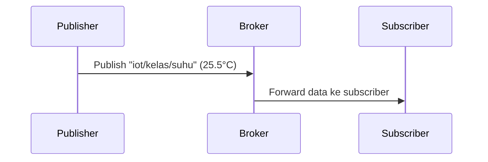

### **Pertemuan 9: MQTT dan IoT**
#### **1. Konsep MQTT**
**Apa itu MQTT?**
- Protokol komunikasi **publish-subscribe** berbasis topik (topic) yang ringan (lightweight), ideal untuk IoT.
- Komponen utama:
  - **Broker**: Server perantara (contoh: Mosquitto, HiveMQ, EMQX).
  - **Publisher**: Device yang mengirim data (contoh: ESP32).
  - **Subscriber**: Device yang menerima data (contoh: Aplikasi monitoring).

**Keunggulan MQTT**:
- Hemat bandwidth dan daya.
- Mendukung QoS (Quality of Service):
  - QoS 0: Pengiriman sekali, tanpa konfirmasi.
  - QoS 1: Pengiriman minimal sekali.
  - QoS 2: Pengiriman tepat sekali.

---

#### **2. Library yang Dibutuhkan**
- **PubSubClient**: Library untuk MQTT pada Arduino/ESP.
- **WiFi**: Untuk koneksi jaringan.
- **DHT**: Untuk membaca sensor (opsional).

Instalasi Library di PlatformIO:
```ini
lib_deps = 
  knolleary/PubSubClient@^2.8
  adafruit/DHT sensor library@^1.4.4
```

---

### **3. Implementasi Praktis**
#### **Komponen yang Dibutuhkan**:
- ESP32/ESP8266
- Sensor DHT22 (opsional, untuk contoh proyek)
- Kabel USB
- Broker MQTT (local/cloud):
  - **Local**: Mosquitto (`mosquitto.org`)
  - **Cloud**: EMQX Cloud (`https://www.emqx.com/en/mqtt/public-mqtt5-broker`)

#### **Rangkaian Elektronika** (jika pakai DHT22):
```
ESP32/ESP8266:
- 3.3V -> VCC DHT22
- GND  -> GND DHT22
- GPIO4 -> DATA DHT22
- Resistor 10kΩ antara DATA dan VCC
```

---

### **Kode Program Lengkap**
#### **ESP32/ESP8266 sebagai Publisher** (Kirim Data Sensor ke Broker):
```cpp
#include <WiFi.h>
#include <PubSubClient.h>
#include <DHT.h>

// Konfigurasi Wi-Fi
const char* ssid = "NAMA_WIFI";
const char* password = "PASSWORD_WIFI";

// Konfigurasi MQTT
const char* mqtt_server = "broker.emqx.io"; // Broker publik
const int mqtt_port = 1883;
const char* mqtt_topic = "iot/kelas/suhu";     // Topik MQTT

// Konfigurasi DHT22
#define DHTPIN 4
#define DHTTYPE DHT22
DHT dht(DHTPIN, DHTTYPE);

WiFiClient espClient;
PubSubClient client(espClient);

void setup_wifi() {
  WiFi.begin(ssid, password);
  while (WiFi.status() != WL_CONNECTED) {
    delay(500);
    Serial.print(".");
  }
  Serial.println("\nTerhubung ke Wi-Fi");
}

void reconnect() {
  while (!client.connected()) {
    String client_id = "ESP32-Client-" + String(random(0xffff), HEX);
    if (client.connect(client_id.c_str())) {
      Serial.println("Terhubung ke Broker MQTT!");
    } else {
      Serial.print("Gagal, rc=");
      Serial.print(client.state());
      Serial.println(" Coba lagi dalam 5 detik...");
      delay(5000);
    }
  }
}

void setup() {
  Serial.begin(115200);
  dht.begin();
  setup_wifi();
  client.setServer(mqtt_server, mqtt_port);
}

void loop() {
  if (!client.connected()) reconnect();
  client.loop();

  float temperature = dht.readTemperature();
  if (isnan(temperature)) {
    Serial.println("Gagal membaca DHT22!");
    return;
  }

  // Kirim data ke broker
  String payload = String(temperature);
  client.publish(mqtt_topic, payload.c_str());
  Serial.print("Data terkirim: ");
  Serial.println(payload);

  delay(5000); // Kirim setiap 5 detik
}
```

---

#### **Penjelasan Kode**:
1. **Koneksi Wi-Fi**:
   - `setup_wifi()`: Menghubungkan ESP ke jaringan Wi-Fi.

2. **Koneksi MQTT**:
   - `reconnect()`: Menghubungkan ke broker dengan ID unik.
   - `client.setServer()`: Set alamat broker dan port.

3. **Publish Data**:
   - `client.publish()`: Mengirim data ke topik `iot/kelas/suhu`.

4. **QoS** (Opsional):
   - Tambahkan parameter QoS di `publish()`:
     ```cpp
     client.publish(mqtt_topic, payload.c_str(), true); // QoS 1
     ```

---

### **4. Contoh Proyek: Monitoring Suhu Real-time**
#### **Langkah-langkah**:
1. **Setup Broker**:
   - Jika lokal, install Mosquitto:
     ```bash
     sudo apt-get install mosquitto mosquitto-clients
     ```
   - Jika cloud, daftar di HiveMQ Cloud (gratis).

2. **Subscribe dari Komputer**:
   - Install MQTT client (contoh: `mosquitto_sub`):
     ```bash
     mosquitto_sub -h broker.emqx.io -t "iot/kelas/suhu"
     ```
   - Akan muncul data suhu dari ESP.

3. **Visualisasi Data** (Opsional):
   - Gunakan Node-RED atau MQTT Dash untuk tampilan grafis.

---

### **5. Troubleshooting**
| Masalah | Solusi |
|---------|--------|
| Gagal konek ke broker | Periksa `mqtt_server` dan port (biasanya 1883) |
| Data tidak terkirim | Cek koneksi Wi-Fi dan status `client.connected()` |
| Broker menolak koneksi | Gunakan broker publik (HiveMQ) atau cek autentikasi |

---

### **Diagram Alur Komunikasi MQTT**


---

### **Referensi**
- [PubSubClient Library](https://github.com/knolleary/pubsubclient)
- [Mosquitto Broker](https://mosquitto.org/)
- [HiveMQ Cloud](https://www.hivemq.com/mqtt-cloud-broker/)

---

### **Kode Program Subscriber MQTT (Kontrol LED)**

#### **Komponen yang Dibutuhkan**:
- ESP32/ESP8266
- LED (pin GPIO2 untuk ESP32, pin D4 untuk ESP8266)
- Resistor 220Ω (untuk LED)
- Kabel USB
- Broker MQTT (contoh: broker.emqx.io)

#### **Rangkaian Elektronika**:
```
ESP32:
- GPIO2 -> LED (+) -> Resistor 220Ω -> GND

ESP8266:
- D4 -> LED (+) -> Resistor 220Ω -> GND
```

---

### **Kode Program**:

```cpp
#include <WiFi.h>
#include <PubSubClient.h>

// Konfigurasi Wi-Fi
const char* ssid = "NAMA_WIFI";
const char* password = "PASSWORD_WIFI";

// Konfigurasi MQTT
const char* mqtt_server = "broker.emqx.io"; // Broker publik
const int mqtt_port = 1883;
const char* mqtt_topic = "iot_lanjut/mat10/mqtt"; // Topik yang di-subscribe

// Konfigurasi LED
#define LED_PIN 2 // GPIO2 (ESP32) atau D4 (ESP8266)

WiFiClient espClient;
PubSubClient client(espClient);

void setup_wifi() {
  WiFi.begin(ssid, password);
  while (WiFi.status() != WL_CONNECTED) {
    delay(500);
    Serial.print(".");
  }
  Serial.println("\nTerhubung ke Wi-Fi");
  Serial.print("Alamat IP: ");
  Serial.println(WiFi.localIP());
}

// Fungsi untuk menangani pesan yang diterima
void callback(char* topic, byte* payload, unsigned int length) {
  Serial.print("Pesan diterima [");
  Serial.print(topic);
  Serial.print("]: ");
  
  // Konversi payload ke string
  String message;
  for (int i = 0; i < length; i++) {
    message += (char)payload[i];
  }
  Serial.println(message);

  // Kontrol LED berdasarkan pesan
  if (message == "on") {
    digitalWrite(LED_PIN, HIGH);
    Serial.println("LED ON");
  } else if (message == "off") {
    digitalWrite(LED_PIN, LOW);
    Serial.println("LED OFF");
  }
}

void reconnect() {
  while (!client.connected()) {
    String client_id = "ESP32-Subscriber-" + String(random(0xffff), HEX);
    if (client.connect(client_id.c_str())) {
      Serial.println("Terhubung ke Broker MQTT!");
      client.subscribe(mqtt_topic); // Subscribe ke topik
    } else {
      Serial.print("Gagal, rc=");
      Serial.print(client.state());
      Serial.println(" Coba lagi dalam 5 detik...");
      delay(5000);
    }
  }
}

void setup() {
  Serial.begin(115200);
  pinMode(LED_PIN, OUTPUT);
  digitalWrite(LED_PIN, LOW);
  
  setup_wifi();
  client.setServer(mqtt_server, mqtt_port);
  client.setCallback(callback); // Set fungsi callback
}

void loop() {
  if (!client.connected()) {
    reconnect();
  }
  client.loop(); // Jaga koneksi MQTT
}
```

---

### **Penjelasan Kode**:
1. **Setup Wi-Fi**:
   - Menghubungkan ESP ke jaringan Wi-Fi.

2. **Setup MQTT**:
   - `client.setCallback(callback)`: Menentukan fungsi yang dipanggil saat pesan masuk.
   - `client.subscribe(mqtt_topic)`: Subscribe ke topik `iot_lanjut/mat10/mqtt`.

3. **Fungsi Callback**:
   - Mengecek isi pesan:
     - Jika `"on"`: LED menyala.
     - Jika `"off"`: LED mati.

4. **Reconnect**:
   - Otomatis menghubungkan ulang jika koneksi terputus.

---

### **Cara Pengujian**:
1. **Upload kode** ke ESP32/ESP8266.
2. **Publish pesan** ke broker menggunakan MQTT client (contoh: `mosquitto_pub`):
   ```bash
   # Nyalakan LED
   mosquitto_pub -h broker.emqx.io -t "iot_lanjut/mat10/mqtt" -m "on"

   # Matikan LED
   mosquitto_pub -h broker.emqx.io -t "iot_lanjut/mat10/mqtt" -m "off"
   ```
3. **Monitor Serial Monitor** untuk melihat log pesan.
4. **Alternatif Software MQTT Client** dengan software [MQTTX](https://github.com/emqx/MQTTX)

---

### **Troubleshooting**:
| Masalah | Solusi |
|---------|--------|
| LED tidak menyala | Periksa koneksi LED dan GPIO |
| Tidak menerima pesan | Pastikan topik sama dengan publisher (`iot_lanjut/mat10/mqtt`) |
| Gagal konek ke broker | Cek `mqtt_server` dan port (1883) |

---

### **Hasil yang Diharapkan**:
- Saat mengirim `"on"`, LED menyala.
- Saat mengirim `"off"`, LED mati.
- Serial Monitor menampilkan log:
  ```
  Pesan diterima [iot_lanjut/mat10/mqtt]: on
  LED ON
  ```

